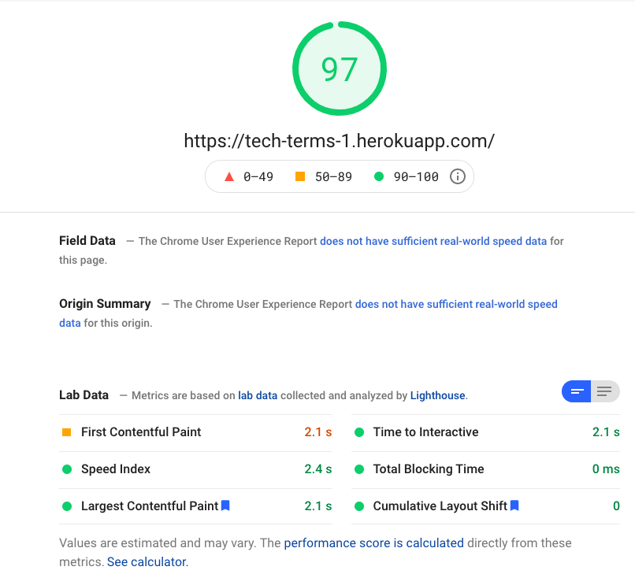
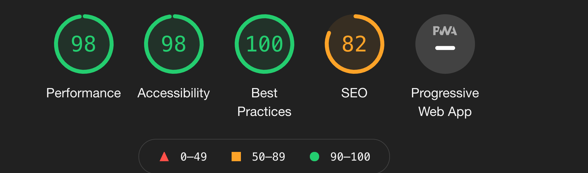

# Testing

---

## Table of Contents:

- [Code Validation](#code-validation)
  - [W3C HTML Validator](#w3c-html-validator)
  - [W3C CSS Jigsaw Validator](#w3c-css-jigsaw-validator)
  - [JSHint](#jshint)
- [Performance](#performance)
  - [PageSpeed Insights](#pagespeed-insights)
  - [Google Lighthouse](#google-lighthouse)
- [User Testing](#user-testing)
  - [Browser Compatibility](#browser-compatibility)
  - [Responsiveness Testing](#responsiveness-testing)
  - [User Stories Testing](#user-stories-testing)
  - [User Inputs Testing](#user-inputs)
- [Bugs](#bugs)

## Code Validation

### W3C HTML Validator

All html - `base.html`, `dashboard.html`, `index.html`, `register.html` and `user_terms.html` - was checked using the HTML Validator on [W3C](https://validator.w3.org/).

The HTML was checked using the W3C validator, it was able to catch duplicate html id attributes and unnecessary roles. There were some errors due to Jinja2 syntax but those were ignored.

### W3C CSS Jigsaw Validator

The Custom CSS `style.css` was validated using [Jigsaw](https://jigsaw.w3.org/css-validator/validator) and had no errors or warnings:

### JSHint

JSHint was used to detect any potential errors or problems in my JS code. It was able to help remove unused variables that I did not notice during development.

The following JS files was tested using JSHint:

[script.js](./static/js/script.js)

[Back to top](#table-of-contents)

---

## Performance

### PageSpeed Insights

I ran the deployed site through Google's PageSpeed Insights to understand the speed of the site. This would be limited as it only checks one page - which was the Login. However, it still provided some interesting feedback. While it scored quite highly, there was some unused javascript and css through the use of jQuery and Bulma. I looked at using a minified version of both but unfortunately, jQuery needed that distribution in order to serialize form data and Bulma had no effect.

### Google Lighthouse

Google Lighthouse was used to test many factors of the website, mainly - Performance, Accessibility, Best Practices and Search Engine Optimisation.

I was able to test more than the login page, as opposed to Pagespeed Insights. SEO did not receive a high score due to uncrawlable links. These uncrawlable links were the anchor buttons for the pagination controls. As they do not change the route of the site, they didn't have `href` attributes.

 

[Back to top](#table-of-contents)

---

## User Testing

### Browser Compatibility

The following functions were tested on the following browsers using a pass / fail system:

**Note**: Responsiveness covers Desktop, Mobile and Tablet.

| Function                 |              Browser              | Result |
| ------------------------ | :-------------------------------: | -----: |
| Register                 | Chrome / Firefox / Safari / Opera |   Pass |
| Login                    | Chrome / Firefox / Safari / Opera |   Pass |
| Search term              | Chrome / Firefox / Safari / Opera |   Pass |
| Pagination controls      | Chrome / Firefox / Safari / Opera |   Pass |
| Expand term              | Chrome / Firefox / Safari / Opera |   Pass |
| Navbar controls          | Chrome / Firefox / Safari / Opera |   Pass |
| Create a term            | Chrome / Firefox / Safari / Opera |   Pass |
| Edit a term              | Chrome / Firefox / Safari / Opera |   Pass |
| Delete a term            | Chrome / Firefox / Safari / Opera |   Pass |
| Logout and clear session | Chrome / Firefox / Safari / Opera |   Pass |

[Back to top](#table-of-contents)

### Responsiveness Testing

Throughout development, responsivess was always considered, especially as it is a single-page application.

The following breakpoints were tested using Chrome Dev Tools:

- **Desktop** - 1920px x 1080px
- **Tablet** - 768px x 1024px
- **Mobile** - 360px x 640px

| Function                     |              Browser              | Result |
| ---------------------------- | :-------------------------------: | -----: |
| Search Input Resposiveness   | Chrome / Firefox / Safari / Opera |   Pass |
| Term Table Responsivness     | Chrome / Firefox / Safari / Opera |   Pass |
| Modals Responsiveness        | Chrome / Firefox / Safari / Opera |   Pass |
| Login Form Responsiveness    | Chrome / Firefox / Safari / Opera |   Pass |
| Register Form Responsiveness | Chrome / Firefox / Safari / Opera |   Pass |

### User Stories Testing

This section will go through each User Story created and see if the objective has succeeded.

- _As a User_, I want to be able to input my own custom location into an input field in order to get weather data from my desired location.
  - User can enter custom location into Input
  - Input is responsive on all devices
     
- _As a User_, I want to be able to successfully submit my input in order to retrieve weather data for my input.
  - Once User has entered in location input and clicks search, the application will successfully return weather results.
  - If the User enters a non-existent or invalid location, the application will return an alert and they can try again.
     
- _As a User_, I want some sort of feedback to let me know my search request has went through.
  - Once the User submits the search, a spinner loader will appear, giving the user some sort of feedback that the app is reading their request.
     
- _As a User_, I want to be able to use my device's location in order to get weather data without needing to type in my location.
  - User can click the custom location icon to grab weather data for their device's location.
  - If the User's browser does not support the Geolocation API or they have blocked permissions, the app will alert the user of this so they can make changes to enable it or change browsers.
     
- _As a User_, I want to be able to view the results of my successful search in order to get an idea of the current weather.
  - Once a search goes through, the live weather container will be displayed.
     
- _As a User_, I want to view the next few days of weather data for my searched location so that I can gain an idea of what the weather will be like in the future.
  - Once a search goes through, the forecast container will be displayed, it will show the next 6 days of weather data (starting tomorrow).
     
- _As a User_, I want to be able to click a hyperlink that will redirect me to a google maps view of my location so I can better plan a trip or excursion.

  - The hyperlink will appear below forecast data, it will then bring them into a new tab so they can return to the site after visiting Google Maps.

- _As a User_, I want to be register an account and for that data to persist.
  - User can enter in Name, Email and Password (all required fields), the information will then be stored in MongoDB.
  - A valid user session is then created.
     
- _As a User_, I want to be login with details I used to register.
  - The User can provide their Email and Password, these will be checked against MongoDB.
  - Once valid, the user will then have a valid session created.
     
- _As a User_, I want to be search for tech terms and retreive their definitions.
  - The User can enter in a term into the input bar.
  - Flask will then send a query to MongoDB and display the result if a term exists.
     
- _As a User_, I want to be able to create a definition for term.
  - The User can create a term using the form.
  - Flask will send a query to MongoDB to see if the term does exists already.
  - Depending on if the term already exists, Flask will create a document in MongoDB for that term and definition.
     
- _As a User_, I want to be able to view all my created term definitions.
  - The User can visit the My Terms page and Flask will display a table of all of their created terms.
  - Flask will do this by checking the User's id with a property 'created_by' on the term's document.
     
- _As a User_, I want to be able to edit my term's definition.
  - Flask will list all of the User's created terms.
  - User can then edit the definition term and save.
     
- _As a User_, I want to be able to delete my term's definition.
  - Flask will attempt to delete the User's term. If the user is the term owner (checks created_by), Flask will delete it from MongoDB.
     
- _As a User_, I want to be able to logout and clear my session.
  - The User can click logout.
  - Flask will clear the session token and bring the User back to the Login page.

[Back to top](#table-of-contents)

### User Inputs

There are various inputs across Tech Terms. They all have some error handling.

On the Login and Register pages, there are the following fields:

- Name
- Email
- Password

These fields are all required for the form to be submitted. Additionally, if any of the details are incorrect, as defined in `models.py`, a relative error will be displayed in a div below the inputs.

There are also user inputs for the following modals:

- Create a term
- Edit a term

For both modals, all fields are required, like above, to submit the form. Moreover, these modals also have an error div that will present the user with any error during the submition. E.g if a term already exists or the character length is too long. There is a character length limit on the definition input in order to keep it concise.

[Back to top](#table-of-contents)

### Bugs

- On the my terms page, there are 2 modals that can appear. Due to this, activating a modal ended up activating both. In order to fix this, I had to create 2 separate functions to handle the opening and closing of these modals.

- The pagination controls for the terms from the library `flask_paginate`, did not have responsive styling. I discovered you could pass a parameter to the Pagination class called css_framework. I was able to use `css_framework=bulma` in order to add styling. I also added custom styling in order for the experience to change depening on whether the User was on desktop or mobile.

- On the my terms page, if a User created a new term, it was not updating the table dynamically. The user would have to refresh. This also occurred when deleting a term (it would still appear in the table until the User refreshed). This was due to having a `e.preventDefault()` on the form submission. Removing this caused a refresh and the terms could be dynamically Edited / Deleted.

 

Click here to go back to [README.md](./README.md#testing)
